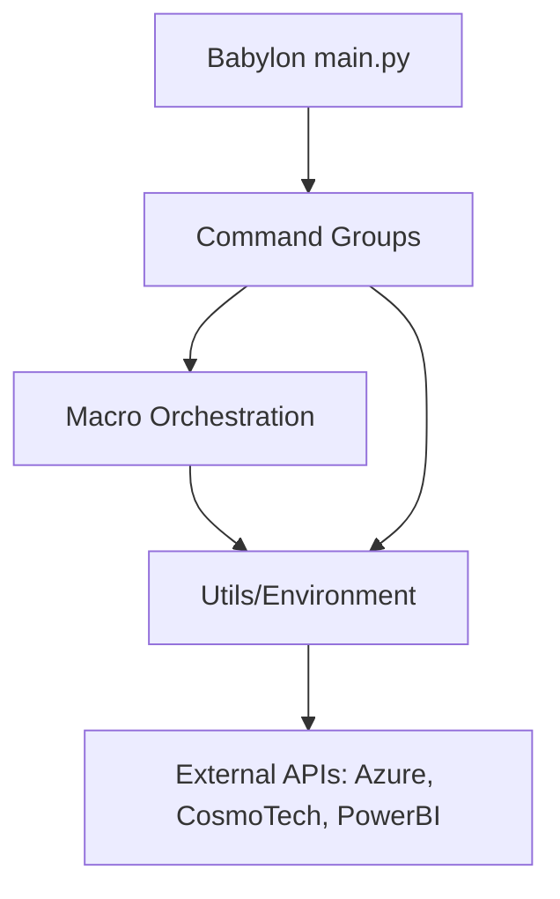

# Project Architecture Blueprint: Babylon

## 1. Architecture Detection and Analysis
Babylon is a **Python-based CLI tool** designed to orchestrate deployments and manage resources within the CosmoTech Platform. It follows a **Modular, Layered Architectural Pattern** with a strong emphasis on **Plugin-oriented extensibility**.

### Technology Stack
- **Language**: Python >= 3.12
- **Frameworks**:
  - `click`: Core CLI handling and command grouping.
  - `rich`: Advanced terminal rendering and logging.
  - `Mako`: Template engine for dynamic YAML generation.
  - `dynaconf`: Configuration management (detected via dependencies).
  - `azure-sdk`: Integration with Azure services (Blob Storage, Identity, RBX).
  - `kubernetes-client`: Integration with K8s clusters for secret management.
  - `cosmotech-api`: Native SDK for CosmoTech Platform interactions.

---

## 2. Architectural Overview
The architecture is centered around a **Centralized Environment Manager** (`Environment` singleton) that maintains the state of the CLI session. Commands are organized into **Logical Domain Clusters** (API, Azure, PowerBI), while **Macros** provide higher-level orchestration by combining multiple domain-specific actions into complex workflows (e.g., `deploy_solution`).

### Guiding Principles
- **Statefulness**: Babylon tracks resource IDs in a "state" file, allowing sequential commands to "know" which organization or solution they are operating on without manual ID passing.
- **Environment Agnosticism**: Through variable substitution and templating, the same command logic can target Dev, QA, or Prod environments.
- **Security by Default**: Integration with Azure Identity (DefaultAzureCredential) and Kubernetes Secrets for sensitive data.

---

## 3. Architecture Visualization
The system can be visualized as three primary layers:

1.  **Orchestration Layer (Macros/Plugins)**: High-level flows that implement business logic (e.g., "Deploy entire workspace").
2.  **Service Layer (Commands)**: Domain-specific operations interacting with external APIs (Azure, PowerBI, CosmoTech).
3.  **Core Infrastructure (Utils/Environment)**: Cross-cutting concerns like Authentication, State Management, and Templating.

---

## 4. Core Architectural Components

### Environment (`Babylon.utils.environment`)
- **Purpose**: A singleton class that holds the global state of the CLI.
- **Responsibility**: Manages active context (tenant, environment), handles variable merging, renders templates, and synchronizes state between local files and Azure Blob Storage.

### Commands (`Babylon.commands`)
- **Structure**: Uses `click.group` to create a hierarchical CLI.
- **Sub-components**:
    - `api/`: Wrappers for the CosmoTech API (Solutions, Organizations, etc.).
    - `azure/`: Management of Azure resources.
    - `macro/`: Multi-step automation scripts.
    - `plugin/`: Management of CLI extensions.

### Templates (`Babylon.templates`)
- **Purpose**: Defines the structure of resources in YAML with Mako placeholders (e.g., `${organization_id}`).
- **Evolution**: Allows users to customize deployment payloads without changing the CLI code.

---

## 5. Architectural Layers and Dependencies

- **Constraint**: Low-level `utils` should never depend on high-level `commands` or `macros` to avoid circular dependencies.

---

## 6. Data Architecture
- **State Model**: YAML-based state files (`state.<context>.<tenant>.<id>.yaml`) store metadata about deployed objects.
- **Variable Merging**: Merges multiple YAML source files to provide a single source of truth for template rendering.
- **Encryption**: `WorkingDir` utility provides Fernet-based encryption for sensitive content within the working directory.

---

## 7. Cross-Cutting Concerns

### Authentication & Authorization
- **CosmoTech API**: Uses Keycloak tokens via `get_keycloak_token()`.
- **Azure**: Uses `DefaultAzureCredential` for seamless integration between local development and CI/CD environments.

### Logging & Monitoring
- **RichHandler**: Provides colorized, readable output in the terminal.
- **File Logging**: Automatically rotates `babylon_info.log` and `babylon_error.log`.

### Configuration Management
- Uses **Variable Files** and **Environment Variables** (API_URL, CLIENT_ID, etc.). Prioritizes Environment Variables > K8s Secrets > Local YAML.

---

## 8. Technology-Specific Patterns (Python)
- **Singleton Pattern**: Used for `Environment` to ensure consistent state across the command lifecycle.
- **Decorators**: Extensively used in `Babylon.utils.decorators` for ASCII art injection, timing, and error handling.
- **Type Hinting**: Consistent use of Python 3.12+ type annotations.

---

## 9. Testing Architecture
- **Unit Tests**: Found in `tests/unit/`, focusing on macro logic and utility functions.
- **Integration Tests**: `tests/integration/` uses shell scripts (`test_api_endpoints.sh`) to validate real API interactions.
- **End-to-End (E2E)**: `tests/e2e/test_e2e.sh` validates full deployment flows.

---

## 10. Blueprint for New Development

### Adding a New Command
1. Create a file in the appropriate `Babylon/commands/<domain>/` folder.
2. Use `@click.command()` and define arguments/options.
3. Return a `CommandResponse` (via `Babylon.utils.response`).
4. Register the command in the domain's `__init__.py`.

### Implementing a New Macro
1. Define the orchestration logic in `Babylon/commands/macro/`.
2. Retrieve active state via `env.retrieve_state_func()`.
3. Use `env.fill_template()` to prepare payloads.
4. Call relevant service functions and update the state using `env.store_state_in_local(state)`.

### Common Pitfalls
- **State Desync**: Failing to save the state after a successful API call.
- **Hardcoded IDs**: Always use `${variable}` in templates instead of hardcoding IDs.
- **Dependency Violations**: Importing `Babylon.commands` from inside `Babylon.utils`.

---

## 11. Architectural Pattern Examples

### Service Interaction Pattern (Macros)
The following snippet from `deploy_solution.py` illustrates how Babylon retrieves state, fills templates, and interacts with APIs:

```python
# Retrieve and render state/templates
state = env.retrieve_state_func()
content = env.fill_template(data=file_content, state=state)

# API Instance from utility
api_instance = get_solution_api_instance(config=config, keycloak_token=keycloak_token)

# Orchestration logic
if not api_section["solution_id"]:
    solution = api_instance.create_solution(...)
    state["services"]["api"]["solution_id"] = solution.id
else:
    api_instance.update_solution(...)

# State Persistence
env.store_state_in_local(state)
```

### Config File Structure
Templates use Mako syntax to inject environment-specific variables:
```yaml
spec:
  payload:
    name: "${solution_name}"
    description: "Deployed via Babylon"
    organizationId: "${services.api.organization_id}"
```

---

## 12. Architectural Decision Records (ADRs)

### ADR 001: Centralized State Management
- **Context**: Users need to perform multi-step deployments where subsequent steps depend on IDs generated in previous steps.
- **Decision**: Implement a local YAML state file managed by a singleton Environment class.
- **Consequence**: Improves developer UX by reducing manual ID passing; requires careful state synchronization (local vs. remote).

### ADR 002: Template-Based Resource Definition
- **Context**: Payload structures for APIs (PowerBI, CosmoTech) are complex and subject to change.
- **Decision**: Externalize resource definitions into YAML templates with variable injection.
- **Consequence**: Users can update deployment logic without rebuilding the CLI.

---

## 13. Architecture Governance
Consistency is enforced through:
- **Linting**: Ruff (configured in `pyproject.toml`).
- **Pre-commit**: Validation of YAML files and Python syntax.
- **CI/CD**: Automatic testing of macros in GitHub Actions to prevent regressions in orchestration logic.
